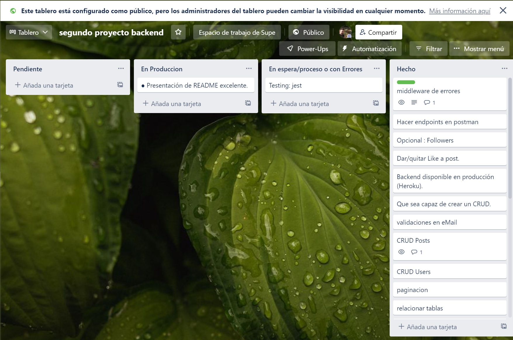

# SocialNetwork - BirrasSociales

<!-- PROJECT LOGO -->

<p align="center">
  
</p>

<!-- TABLE OF CONTENTS -->
<details>
  <summary>Table of Contents</summary>
  <ol>
    <li>
      <a href="#about-the-project">About The Project</a>
      <ul>
        <li><a href="#built-with">Built With</a></li>
      </ul>
    </li>
    <li>
      <a href="#getting-started">Getting Started</a>
      <ul>
        <li><a href="#installation">Installation</a></li>
      </ul>
    </li>
    <li><a href="#usage">Usage</a></li>
    <li><a href="#roadmap">Roadmap</a></li>
    <li><a href="#license">License</a></li>
    <li><a href="#contact">Contact</a></li>
    <li><a href="#acknowledgments">Acknowledgments</a></li>
  </ol>
</details>

<!-- ABOUT THE PROJECT -->

## About The Project

Second backEnd proyect in the Bridge tech academy.

The backend project will combine the knowledge acquired in the
node + express technologies, in addition to MongoDB/mongoose.
The project will consist of a social network.

Technologies

For the development of the API we will use MongoDB with Mongoose and express.
The project will be uploaded to a public GitHub repository and the
existence of branches, as well as several commits of high readable quality for
analyze the evolution of the project.
It will be an essential requirement that the repository has a Readme
complete.


Use [this Link](https://docs.google.com/document/d/1Ls9hd-X-NSqukJ0G-VKlXq8PXSQ6wrAJCrXZtu69rMY/edit) to see the proyect requirements.

<p align="right">(<a href="#top">back to top</a>)</p>

### Built With

This section should list any major frameworks/libraries used to bootstrap your project. Leave any add-ons/plugins for the acknowledgements section. Here are a few examples.

- [Node.js](https://node.org/)
- [React.js](https://reactjs.org/)
- [Mongo](https://www.mongodb.com/)
- [Mongoose](https://mongoosejs.com/)
- [Postman](https://www.postman.com/)
- [JWT](https://jwt.io//)
- [.ENV](https://dotenv.io//)
- [Heroku](https://id.heroku.com/)

## Packages Installed

* [bcrypt](https://www.npmjs.com/package/bcrypt)
* [dotenv](https://www.npmjs.com/package/dotenv)
* [express](https://www.npmjs.com/package/express)
* [jsonwebtoken](https://www.npmjs.com/package/jsonwebtoken)
* [mongoose](https://www.npmjs.com/package/mongoose)
* [multer](https://www.npmjs.com/package/multer)
* [nodemailer](https://www.npmjs.com/package/nodemailer)
* [Jester](https://www.npmjs.com/package/jester)


## Trello

with [trello](https://trello.com/b/GS70Xdtg/segundo-proyecto-backend) you can organice the whole proyect in a easy way




<p align="right">(<a href="#top">back to top</a>)</p>

<!-- GETTING STARTED -->

## Getting Started

It would be advisable to follow the instructions, for a correct functioning of the API

### Used Packages

This is What we have Used for the Proyect

- npm

  ```
  npm init -y

  npm install express mongoose dotenv


  ```

-Used dependencies.

```
    "bcryptjs": "^2.4.3",
    "chalk": "^5.0.1",
    "dotenv": "^16.0.1",
    "express": "^4.18.1",
    "jsonwebtoken": "^8.5.1",
    "logplease": "^1.2.15",
    "mongoose": "^6.3.5",
    "multer": "^1.4.5-lts.1",
    "nodemailer": "^6.7.5",
    "validator": "^13.7.0"

  ```


### Installation

_Below is an example of how you can instruct your audience on installing and setting up your app. This template doesn't rely on any external dependencies or services._

1. Clone the repo
   ```sh
   git clone https://github.com/Dubesor22/proyect-mongo-mongoose
   ```
2. Install NPM packages
   ```sh
   npm install
   ```

<p align="right">(<a href="#top">back to top</a>)</p>

<!-- USAGE EXAMPLES -->

## Usage

This is a list of Endpoints that you can use in postman to Test our Project.

Endpoints are related on the Postman documentation.

Full API endpoints documentation:

[https://documenter.getpostman.com/view/11287519/Uz5JGun8](https://documenter.getpostman.com/view/11287519/Uz5JGun8)


<p align="right">(<a href="#top">back to top</a>)</p>
## Postman

<!-- ROADMAP -->

## Roadmap

- [x] User registration using Bcrypt.
- [x] A User login + token + middleware.
- [x] That is capable of creating a CRUD.


Essential requirements of the project:

- [x] Use of branches with git, when the project is finished there should be two branches, the master or main and the develop.
- [x] Excellent README presentation.
      See the [COMPLETE LIST of requisites](https://docs.google.com/document/d/1yey2fRgu8OkH0T2EUfP3Svixxq7geW1HmxxoOExK6Go/edit#)

<p align="right">(<a href="#top">back to top</a>)</p>

<!-- LICENSE -->

## License

This program is Open Source and anyone can use it, mention to its creators is appreciated.

<p align="right">(<a href="#top">back to top</a>)</p>

<!-- CONTACT -->
proyect-mongo-mongoose
## Contact

David Ubeda - [gitHub](https://github.com/dubesor22)

Project Link: [Repo](https://github.com/dubesor22/proyect-mongo-mongoose)

<p align="right">(<a href="#top">back to top</a>)</p>

<!-- ACKNOWLEDGMENTS -->

## Acknowledgments

- [x] Node and React usage
- [x] MongoBd and Moongose Skills
- [x] middleware management
- [x] capable of creating a CRUD.
- [x] capable to connect to a database
- [x] Better Management of Git, Using branches and Working at same time.
- [x] npm Knowledge whith several of its libraries
- [x] Heroku knowledge, and deploy

<p align="right">(<a href="#top">back to top</a>)</p>

<!-- MARKDOWN LINKS & IMAGES -->
<!-- https://www.markdownguide.org/basic-syntax/#reference-style-links -->

[contributors-shield]: https://img.shields.io/github/contributors/othneildrew/Best-README-Template.svg?style=for-the-badge
[contributors-url]: https://github.com/othneildrew/Best-README-Template/graphs/contributors
[forks-shield]: https://img.shields.io/github/forks/othneildrew/Best-README-Template.svg?style=for-the-badge
[forks-url]: https://github.com/othneildrew/Best-README-Template/network/members
[stars-shield]: https://img.shields.io/github/stars/othneildrew/Best-README-Template.svg?style=for-the-badge
[stars-url]: https://github.com/othneildrew/Best-README-Template/stargazers
[issues-shield]: https://img.shields.io/github/issues/othneildrew/Best-README-Template.svg?style=for-the-badge
[issues-url]: https://github.com/othneildrew/Best-README-Template/issues
[license-shield]: https://img.shields.io/github/license/othneildrew/Best-README-Template.svg?style=for-the-badge
[license-url]: https://github.com/othneildrew/Best-README-Template/blob/master/LICENSE.txt
[linkedin-shield]: https://img.shields.io/badge/-LinkedIn-black.svg?style=for-the-badge&logo=linkedin&colorB=555
[linkedin-url]: https://linkedin.com/in/othneildrew
[product-screenshot]: images/screenshot.png
